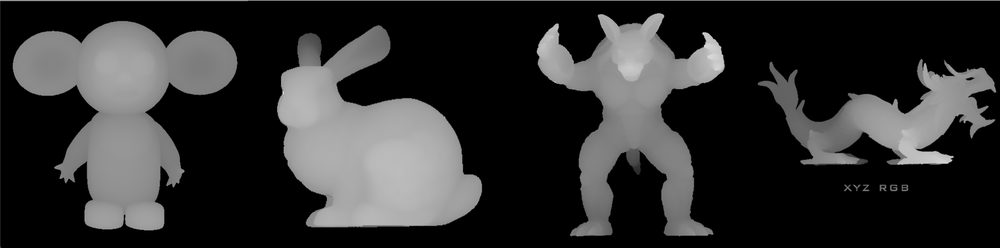

# graphics-zbuffer

#### 要求：实现层次z-buffer算法

- 简单模式(仅包含层次z-buffer)、完整模式(层次z-buffer+场景八叉树)
- 分别对比简单模式和完整模式与扫描线z-buffer算法的加速比
- 评价指标: 面片不少于5000个; 应当含非凸多面体; 算法效率; 是否有加速等，综合考虑。

#### 提交

- 说明文档(编程环境、用户界面使用说明、简单的 数据结构说明、加速等)、源代码和工程文件、实验结果报告。

- 2021年1月15日之前将作业发至邮箱jqfeng@cad.zju.edu.cn，CG+姓名+学号


### 说明文档

编程环境：

- 操作系统：macOS 11.0.1
- 编译工具：cMake 3.18.2
- 库：Eigen 3.3.7，OpenGL，GLUT


使用：

```shell
mkdir build
cd build
cmake ..
make

# Run: ./src/render <type> <model_path>
# type can be 1:zbuffer 2:zbuffer(basic) 3:hierarchical zbuffer(basic) 4:hierarchical zbuffer(octree)
# example
./src/render 2 ../src/models/lowpolytree.obj
```


效果展示




算法描述：

zbuffer：

- 每个pixel和每个triangle求交，选最小的depth。

zbuffer(basic)：

- 读取每个triangle，找到triangle的bounding box，遍历，判断该像素是否与三角形相交，如果相交计算depth并更新depth buffer。（注意考虑四角形）

hierarchical zbuffer(basic)：

- 为什么要用层次z-buffer，可以快速确定一个polygon是不是隐藏，而不用pixel-by-pixel去确定
- 构造z-pyramid: 初始图像大小作为最后一层，下一层是上一层下采样，min pooling
- 维护z-pyramid: 每次更改z值都要传递下去
- 测试visubility：找到最精确的能包括这个polygon的，如果值>max_depth of polygon，那么就被隐藏，如果没有被隐藏，那么更新层次z-buffer

hierarchical zbuffer(octree)：

- 将几何体放入八叉树：首先获得整个场景的包围盒，定义*OctreeNode*, 从根节点开始递归插入，如果面片数量少于3，则返回，否则计算8个子节点的包围盒以及将面片分到8个子节点中，继续递归。
- 然后，从八叉树的根节点开始，递归进行渲染：首先，检查八叉树立方体是否与视锥相交。如果没有，我们就完成了。如果多维数据集确实与查看视锥相交，则我们将多维数据集的面进行扫描转换，以确定是否隐藏了整个多维数据集。如果多维数据集是隐藏的，那么我们就完成了。否则，我们将扫描转换与该多维数据集关联的任何几何图形，然后以从前到后的顺序递归地渲染其子级。


